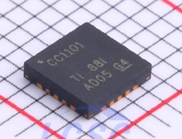

<center>


Created by Ouroboros Embedded Education.
</center>

# CC1101 RF Driver Documentation


<center></center>

This documentation describes the implementation and usage of the `cc1101.c` file, which provides an RF driver for the Texas Instruments CC1101 transceiver. The driver is designed for embedded systems and supports a variety of modulation and frequency configurations.

---

## Table of Contents

- [CC1101 RF Driver Documentation](#cc1101-rf-driver-documentation)
  - [Table of Contents](#table-of-contents)
  - [Overview](#overview)
  - [Features](#features)
  - [Power Amplifier Tables (PATABLES)](#power-amplifier-tables-patables)
  - [Modulation Presets](#modulation-presets)
    - [Example: GFSK 1.2 kbps](#example-gfsk-12-kbps)
  - [Initialization and Configuration](#initialization-and-configuration)
    - [Initialization Steps](#initialization-steps)
    - [Required User Functions](#required-user-functions)
    - [Example Usage](#example-usage)
  - [Dependencies and Platform Integration](#dependencies-and-platform-integration)
  - [Important Notes](#important-notes)
  - [References](#references)

---

## Overview

The `cc1101.c` file implements a driver for the CC1101 RF transceiver, providing initialization, configuration, and control routines. It supports multiple ISM bands and modulation schemes, allowing flexible adaptation for different RF communication requirements.

- **Author:** dsoldevila
- **Original Contributors:** SpaceTeddy ([GitHub](https://github.com/SpaceTeddy/CC1101)), EMCU.EU ([emcu.eu](http://www.emcu.eu/how-to-implement-printf-for-send-message-via-usb-on-stm32-nucleo-boards-using-atollic))
- **Tested Modulation:** Only GFSK_1_2KB is confirmed working; other presets may require adjustment.

---

## Features

- **Multiple ISM bands:** 315, 433, 868, and 915 MHz supported.
- **Modulation schemes:** GFSK (1.2, 38.4, 100 kbps), MSK (250, 500 kbps), OOK (4.8 kbps).
- **Configurable output power:** Power amplifier tables for each frequency band.
- **Register presets:** Predefined register arrays for quick setup.
- **Hardware abstraction:** User must provide platform-specific functions for SPI, GPIO, and timing.

---

## Power Amplifier Tables (PATABLES)

The driver includes power amplifier lookup tables for each ISM band. These tables define the optimal register values for output power levels ranging from -30 dBm to +10 dBm.

```c
const uint8_t patable_power_315[] = {0x17,0x1D,0x26,0x69,0x51,0x86,0xCC,0xC3};
const uint8_t patable_power_433[] = {0x6C,0x1C,0x06,0x3A,0x51,0x85,0xC8,0xC0};
const uint8_t patable_power_868[] = {0x03,0x17,0x1D,0x26,0x50,0x86,0xCD,0xC0};
const uint8_t patable_power_915[] = {0x0B,0x1B,0x6D,0x67,0x50,0x85,0xC9,0xC1};
```


---

## Modulation Presets

The driver provides register configuration arrays for various modulation schemes and data rates. These arrays are written to the CC1101 during initialization.

### Example: GFSK 1.2 kbps

```c
const uint8_t cc1100_GFSK_1_2_kb[] = {
    // IOCFG2, IOCFG1, IOCFG0, FIFOTHR, SYNC1, SYNC0, PKTLEN, PKTCTRL1, PKTCTRL0, ADDR, CHANNR,
    // FSCTRL1, FSCTRL0, FREQ2, FREQ1, FREQ0, MDMCFG4, MDMCFG3, MDMCFG2, MDMCFG1, MDMCFG0,
    // DEVIATN, MCSM2, MCSM1, MCSM0, FOCCFG, BSCFG, AGCCTRL2, AGCCTRL1, AGCCTRL0, WOREVT1,
    // WOREVT0, WORCTRL, FREND1, FREND0, FSCAL3, FSCAL2, FSCAL1, FSCAL0, RCCTRL1, RCCTRL0,
    // FSTEST, PTEST, AGCTEST, TEST2, TEST1, TEST0
    0x07, 0x2E, 0x80, 0x07, 0x57, 0x43, 0x3E, 0xD8, 0x45, 0xFF, 0x00,
    0x08, 0x00, 0x21, 0x65, 0x6A, 0xF5, 0x83, 0x13, 0xC0, 0xF8,
    0x15, 0x07, 0x00, 0x18, 0x16, 0x6C, 0x03, 0x40, 0x91, 0x02,
    0x26, 0x09, 0x56, 0x17, 0xA9, 0x0A, 0x00, 0x11, 0x41, 0x00,
    0x59, 0x7F, 0x3F, 0x81, 0x3F, 0x0B
};
```

> **Note:** Only the GFSK_1_2KB preset is thoroughly tested. Others may require adjustment.

---

## Initialization and Configuration

The main initialization function sets up the CC1101 transceiver:

```c
uint8_t cc1101_init(cc1101_t *cc1101, cc1101_params_t *params);
```


### Initialization Steps

1. **Parameter Validation:** Checks for valid pointers, ISM band, modulation, and hardware abstraction functions.
2. **Pinout Linking:** Connects the driver to user-supplied SPI, GPIO, and delay functions.
3. **Register Setup:** Loads the appropriate preset register array for the selected modulation and writes it to the CC1101.
4. **Power Table Setup:** Loads the correct PATABLE for the selected ISM band and output power.
5. **Timeouts:** Sets default timeouts (e.g., 30 seconds).

### Required User Functions

You must provide the following function pointers in `cc1101_params_t`:

- `fxCsGpio`: Chip select GPIO control
- `fxDelayUs`: Microsecond delay
- `fxSpiRead`: SPI read
- `fxSpiWrite`: SPI write


### Example Usage

```c
cc1101_params_t params = {
    .eIsmBand = ISMBAND_MHz433,
    .eModulation = MOD_GFSK_1_2_kb,
    .fxCsGpio = my_cs_gpio,
    .fxDelayUs = my_delay_us,
    .fxSpiRead = my_spi_read,
    .fxSpiWrite = my_spi_write,
    .u32XtalFreqMhz = 26
};

cc1101_t cc1101;
cc1101_init(&amp;cc1101, &amp;params);
```


---

## Dependencies and Platform Integration

- **SPI and GPIO:** The driver is hardware-agnostic but requires user-supplied low-level functions for SPI and GPIO.
- **Timing:** Microsecond-level delays are needed for proper operation.
- **Assertions:** Uses `assert()` for parameter checking.

---

## Important Notes

- **Tested Modulation:** Only `GFSK_1_2KB` is confirmed to work out of the box.
- **Other Presets:** May require register tuning for reliable operation.
- **Wake-on-Radio (WOR):** Supported via register configuration.
- **State Functions:** Some state transition helpers are included but are simple.

---

## References

- [TI CC1101 Datasheet](https://www.ti.com/product/CC1101)

---

**For further details, refer to the comments and code in `cc1101.c`.**
**If you use a modulation preset other than GFSK_1_2KB, review and adjust the register values as needed for your application.**
